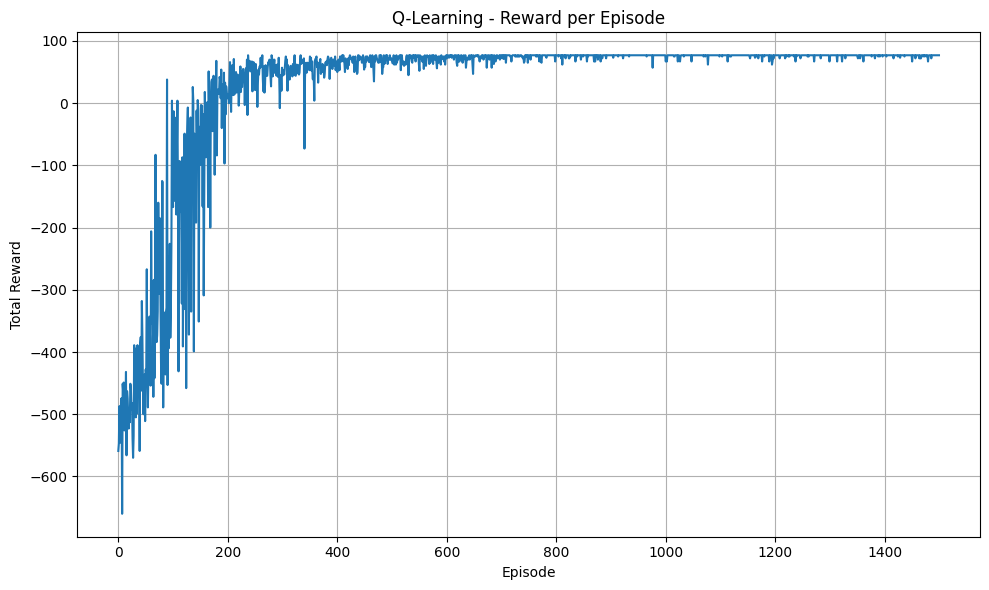
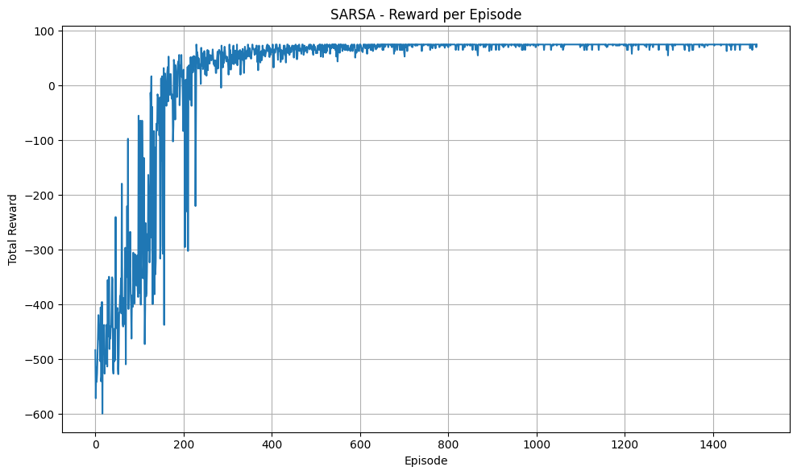
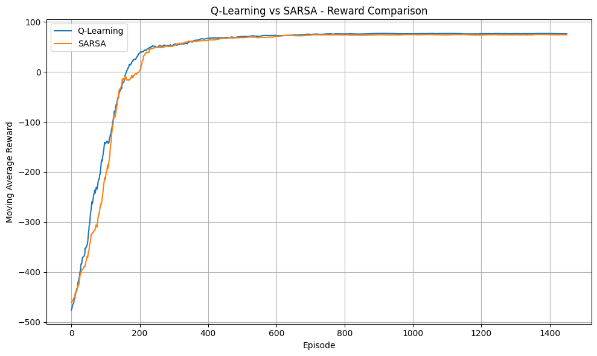
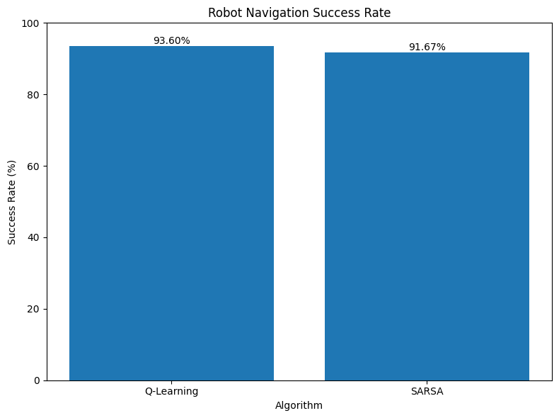
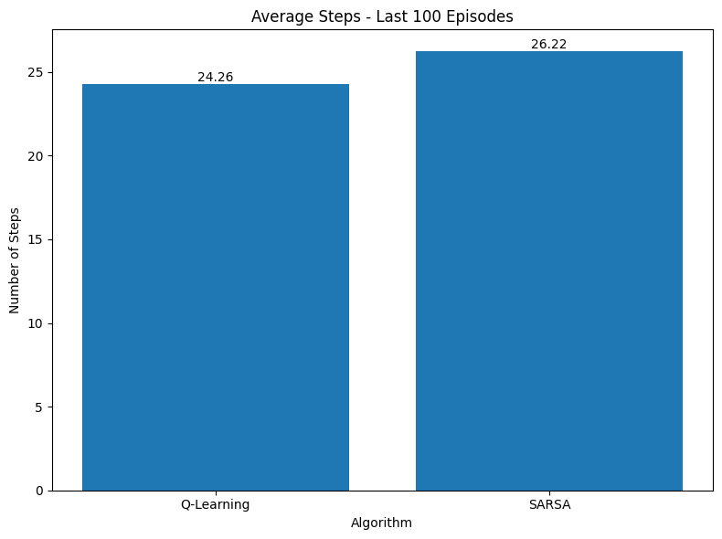
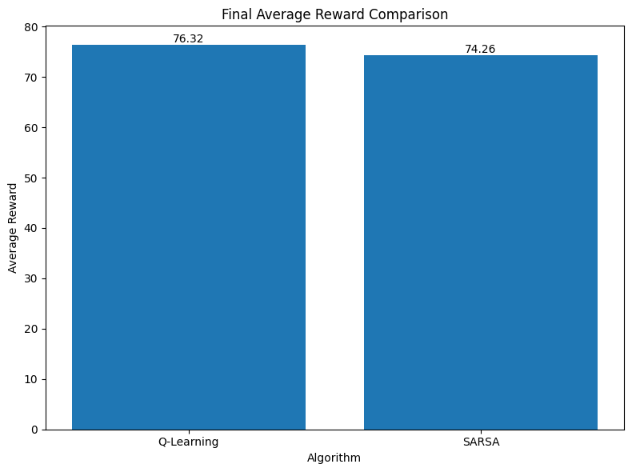
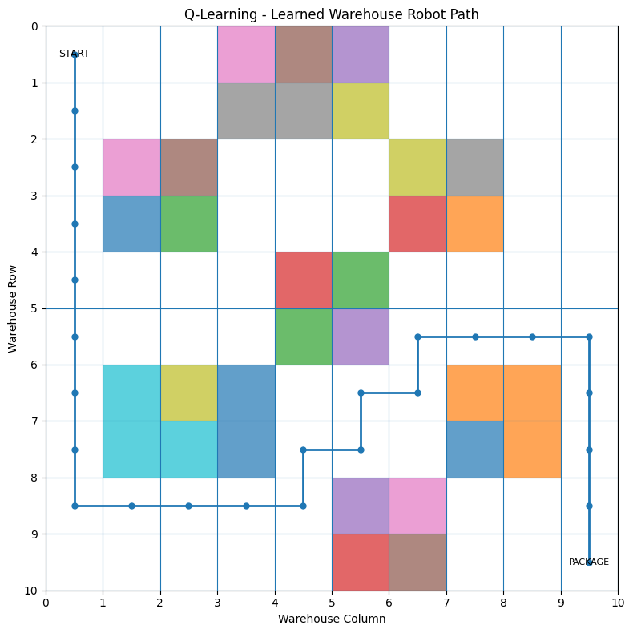
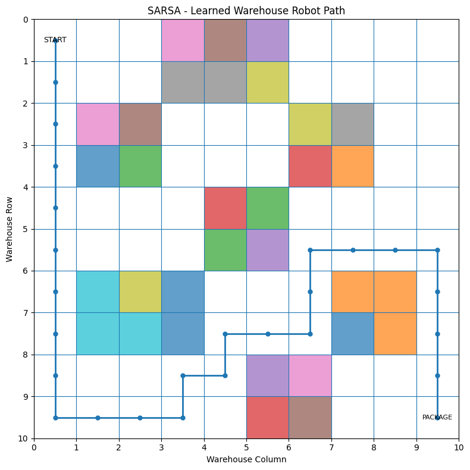

# Smart Warehouse Robot Navigation
### Q-Learning vs SARSA — Reinforcement Learning Comparison

---

## Overview

This project trains a robot to navigate a 10×10 warehouse grid from a **charging station** at position `(0, 0)` to a **package pickup point** at `(9, 9)`, while avoiding shelves and obstacles.

Two reinforcement learning algorithms are implemented and compared:
- **Q-Learning** — an off-policy TD algorithm
- **SARSA** — an on-policy TD algorithm

---

## Files

| File | Description |
|---|---|
| `Reinforcement_Model.ipynb` | Original Jupyter notebook (Google Colab) |
| `reinforcement_model.py` | Full Python source code extracted from the notebook |
| `README.md` | This file |

---

## Environment

| Property | Value |
|---|---|
| Grid size | 10 × 10 |
| Start | `(0, 0)` — Charging Station |
| Goal | `(9, 9)` — Package Location |
| Obstacles | 30 cells representing warehouse shelves |
| Actions | Up, Down, Left, Right |

### Reward Structure

| Event | Reward |
|---|---|
| Normal move | −1 |
| Hit a wall (out of bounds) | −5 |
| Hit an obstacle (shelf) | −10 |
| Reach the goal | +100 |

---

## Algorithms

### Q-Learning (Off-Policy)
Updates the Q-value using the **best possible next action**, regardless of what action is actually taken next. This makes it more aggressive and optimal in deterministic environments.

```
Q(s, a) ← Q(s, a) + α [ r + γ · max Q(s', a') − Q(s, a) ]
```

### SARSA (On-Policy)
Updates the Q-value using the **actual next action** chosen by the current policy (including exploration). This makes it more conservative and safer.

```
Q(s, a) ← Q(s, a) + α [ r + γ · Q(s', a') − Q(s, a) ]
```

---

## Hyperparameters

| Parameter | Value |
|---|---|
| Episodes | 1500 |
| Max steps per episode | 150 |
| Learning rate (α) | 0.1 |
| Discount factor (γ) | 0.95 |
| Epsilon start | 1.0 |
| Epsilon minimum | 0.01 |
| Epsilon decay | 0.995 |

---

## Training Log

```
============================================================
Training Q-Learning...
Q-Learning completed!

Training SARSA...
SARSA completed!
============================================================
```

---

## Results

| Metric | Q-Learning | SARSA |
|---|---|---|
| Final Average Reward | **76.32** | 74.26 |
| Success Rate | **93.60%** | 91.67% |
| Avg Steps (last 100 eps) | **24.26** | 26.22 |
| Learned Path Length | **25 steps** | 27 steps |

**Winner: Q-Learning** across all four metrics.

---

## Plots

The model generates 8 plots during training and evaluation:

### Graph 1 — Q-Learning: Reward per Episode
Raw per-episode reward curve for Q-Learning showing improvement from random exploration toward consistently high rewards.



### Graph 2 — SARSA: Reward per Episode
Raw per-episode reward curve for SARSA showing a similar learning trend to Q-Learning but with slightly different variance.



### Graph 3 — Reward Comparison (Moving Average, window=50)
Smoothed reward curves for both algorithms overlaid on the same plot for direct comparison. Q-Learning converges slightly faster and higher.



### Graph 4 — Success Rate
Percentage of episodes where the robot successfully reached the package.

| Algorithm | Success Rate |
|---|---|
| Q-Learning | **93.60%** |
| SARSA | 91.67% |



### Graph 5 — Average Steps (Last 100 Episodes)
Mean number of steps taken per episode in the final 100 episodes — lower is more efficient.

| Algorithm | Avg Steps |
|---|---|
| Q-Learning | **24.26** |
| SARSA | 26.22 |



### Graph 6 — Final Average Reward Comparison
Mean reward over the last 100 episodes for each algorithm.

| Algorithm | Avg Reward |
|---|---|
| Q-Learning | **76.32** |
| SARSA | 74.26 |



### Graph 7 — Q-Learning: Learned Warehouse Path
10×10 grid showing the optimal route discovered by Q-Learning (START → PACKAGE). Shaded cells are obstacles. **Path length: 25 steps.**



### Graph 8 — SARSA: Learned Warehouse Path
10×10 grid showing the optimal route discovered by SARSA (START → PACKAGE). Shaded cells are obstacles. **Path length: 27 steps.**



---

## How to Run

### Requirements

```bash
pip install numpy matplotlib
```

### Run the script

```bash
python reinforcement_model.py
```

Or open `Reinforcement_Model.ipynb` in [Google Colab](https://colab.research.google.com/) or Jupyter.

---

## Key Takeaway

Q-Learning outperformed SARSA across all metrics: higher success rate (+1.93%), higher average reward (+2.06), fewer average steps per episode (−1.96), and a shorter learned path (−2 steps).

This is consistent with Q-Learning's **off-policy** nature — it always backs up from the greedy best next action during updates, learning the optimal policy directly. SARSA's **on-policy** updates account for the current exploratory policy, making it more conservative but slightly less optimal in this deterministic environment.
